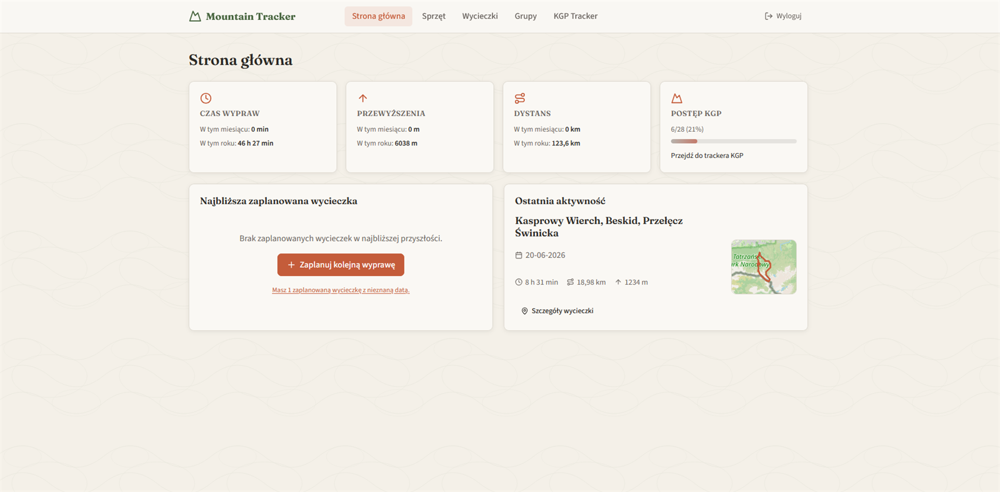
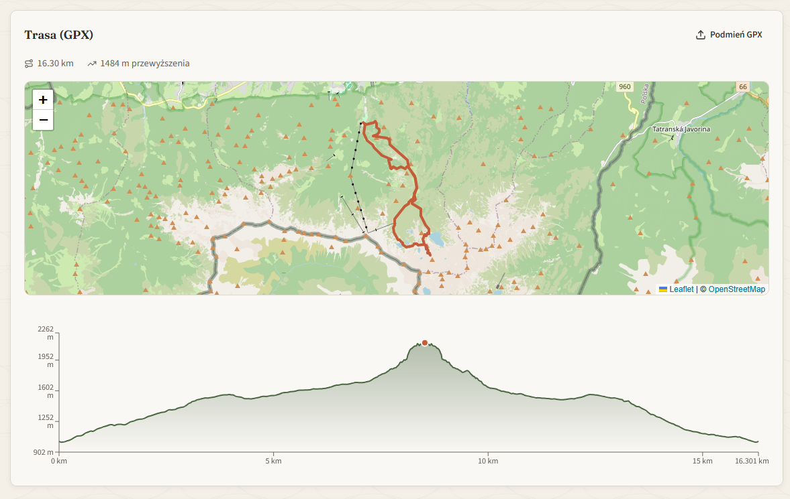
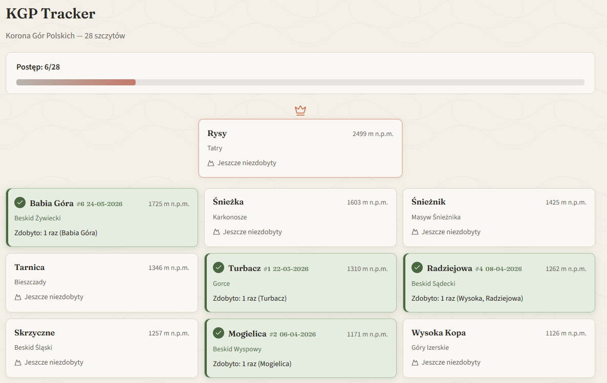
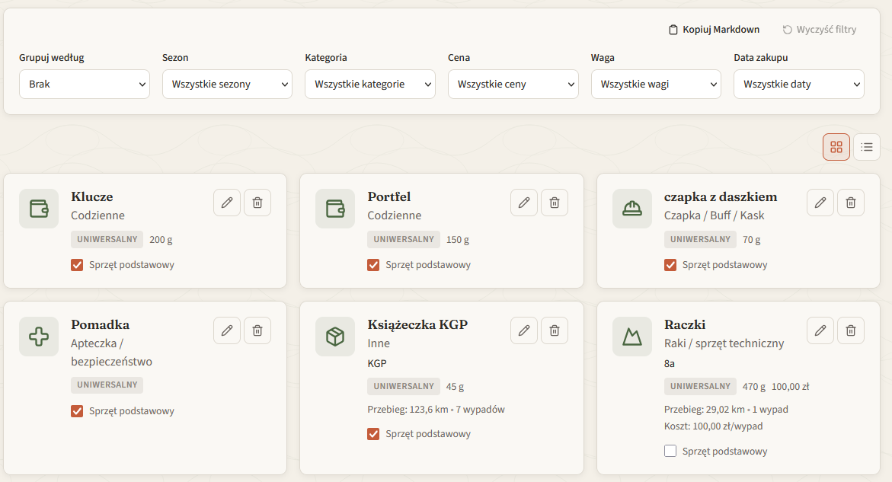

# Mountain Gear Tracker


Aplikacja webowa do zarządzania sprzętem górskim, planowania wycieczek i śledzenia postępu w Koronie Gór Polskich (KGP). 
Wykonana jako test możliwości cursora pro.

## Zrzuty ekranu

<table>
  <tr>
    <td align="center">
      <br>
      <sub><b>Dashboard</b></sub>
    </td>
    <td align="center">
      <br>
      <sub><b>Mapa trasy z profilem wysokościowym</b></sub>
    </td>
  </tr>
  <tr>
    <td align="center">
      <br>
      <sub><b>Postęp KGP</b></sub>
    </td>
    <td align="center">
      <br>
      <sub><b>Sprzęt</b></sub>
    </td>
  </tr>
</table>

## Spis treści

- [Opis](#opis)
- [Tech stack](#tech-stack)
- [Wymagania](#wymagania)
- [Instalacja](#instalacja)
- [Uruchomienie](#uruchomienie)
- [Przykład użycia](#przykład-użycia)
- [Konfiguracja](#konfiguracja)
- [Struktura projektu](#struktura-projektu)
- [Licencja](#licencja)

## Opis

Mountain Gear Tracker to lokalna aplikacja webowa (bez hostingu i bez chmury), która ułatwia organizację wycieczek i kontrolę postępu w KGP. Dostęp do aplikacji jest chroniony przez proste logowanie/rejestrację z użyciem JWT, a wszystkie dane są przechowywane lokalnie.

Aplikacja obejmuje m.in.:

- **Sprzęt (CRUD)**: dodawanie/edycja/usuwanie sprzętu, filtrowanie po kategorii i sezonie oraz obsługa ikon przypisanych do kategorii.
- **Wycieczki (CRUD)**: planowanie (`planowana`) i oznaczanie jako zrealizowana (`zrealizowana`), edycja danych, notatki, lista sprzętu do spakowania oraz oceny.
- **Usuwanie wycieczek „do zera”**: przy usuwaniu wycieczki kasowane są także powiązane pliki ze `server/uploads` (GPX/FIT/zdjęcia).
- **Szczegóły wycieczki**:
  - **Zdjęcia**: upload wielu zdjęć naraz, galeria z lightboxem oraz możliwość usuwania zdjęć.
  - **Lista pakowania**: checkboxy „spakowane” i „noszone”, dodawanie/usuwanie elementów z listy oraz status kompletności dla wycieczek planowanych.
  - **Trasa (GPX)**: mapa z Leaflet (OpenStreetMap), podsumowanie dystansu i przewyższenia oraz interaktywny wykres profilu wysokościowego (podpowiedź z dokładną wysokością i informacją o wejściach/zejściach).
  - **Telemetria (FIT)**: upload pliku `.fit` i uzupełnianie czasów/metryk zależnie od danych w urządzeniu.
- **Pogoda**:
  - dla wycieczek planowanych: pobierana prognoza z Open-Meteo na podstawie szer./dł. geograficznej;
  - dla wycieczek zrealizowanych: zapis „oficjalnej pogody z dnia wycieczki” jako snapshot z Open-Meteo Archive API (liczy się to już jako dane trwałe).
- **Oceny**: oceny w kategoriach (domyślnie „Szczyt” i „Trasa”), dodawanie własnych kategorii oraz automatyczny wynik końcowy jako średnia z ocen (zaokrąglana do 1 miejsca po przecinku).
- **Tracker KGP**: lista 28 szczytów z podziałem na pasma, pasek postępu X/28 oraz informacja, ile razy szczyt został zdobyty wraz z linkami do powiązanych wycieczek.
- **Grupy**: tworzenie grup, zaproszenia kodem oraz (opcjonalnie) wspólne listy pakowania dla członków grupy.

Dane przechowywane są lokalnie w SQLite (`server/data/db.sqlite`) oraz w katalogu uploadów (`server/uploads/`).

## Tech stack

| Warstwa | Technologie |
|---------|-------------|
| **Frontend** | React 18, TypeScript, Vite, React Router, Tailwind CSS, Lucide React, Recharts, Leaflet |
| **Backend** | Node.js, Express, TypeScript, better-sqlite3, Multer, JWT + bcrypt |
| **Współdzielone** | Pakiet `@mountain-tracker/shared` (typy, parsowanie GPX, logika tras) |
| **Dane zewnętrzne** | Open-Meteo (pogoda, geokodowanie), OpenStreetMap (kafelki mapy) |
| **Produkcja** | Docker, Docker Compose |

## Wymagania

- **Node.js** ≥ 18 (zalecane 20 lub 22)
- **npm** ≥ 9
- Narzędzia do kompilacji natywnych modułów Node (`better-sqlite3`, `bcrypt`) — na Windowsie zwykle wystarczy [Visual Studio Build Tools](https://visualstudio.microsoft.com/visual-cpp-build-tools/) z workloadem „Desktop development with C++”

Opcjonalnie do uruchomienia w kontenerze: **Docker** i **Docker Compose**.

## Instalacja

Sklonuj repozytorium i zainstaluj zależności we wszystkich pakietach (root, `shared`, `client`, `server`):

```bash
git clone <url-repozytorium>
cd MountainTracker
npm run setup
```

Polecenie `setup` instaluje paczki npm, buduje moduł `shared` i przygotowuje frontend oraz backend do pracy.

## Uruchomienie

### Tryb deweloperski

```bash
npm run dev
```

Aplikacja jest dostępna pod adresem **http://localhost:8082**.

W trybie dev Express uruchamia Vite w trybie middleware — jeden serwer obsługuje zarówno API, jak i interfejs użytkownika.

### Tryb produkcyjny (lokalnie)

```bash
npm run build
```

**Windows (PowerShell):**

```powershell
$env:NODE_ENV="production"; npm start
```

**Linux / macOS:**

```bash
NODE_ENV=production npm start
```

### Docker

```bash
docker compose up --build
```

Aplikacja działa na porcie **8082**. Wolumeny montują `server/data` i `server/uploads`, więc baza i pliki użytkownika przetrwają restart kontenera.

## Przykład użycia

Poniższy scenariusz pokazuje typowy przepływ pracy w aplikacji.

### 1. Rejestracja i logowanie

1. Otwórz http://localhost:8082/rejestracja i utwórz konto (login, hasło ≥ 8 znaków, imię).
2. Zaloguj się na http://localhost:8082/logowanie.

### 2. Dodanie sprzętu

1. Przejdź do **Sprzęt** (`/sprzet`).
2. Dodaj pozycję, np. *Kurtka softshell Patagonia*, kategoria *Kurtka / Softshell*, sezon *uniwersalny*.
3. Filtruj listę po kategorii lub sezonie.

### 3. Zaplanowanie wycieczki KGP

1. Otwórz **Wycieczki** (`/wycieczki`) → **Nowa wycieczka**.
2. Wybierz szczyt z listy KGP, np. *Babia Góra*, ustaw datę i szacowany czas trwania.
3. W szczegółach wycieczki:
   - zaznacz sprzęt na **liście pakowania**;
   - sprawdź **prognozę pogody** dla lokalizacji szczytu;
   - po powrocie wgraj plik **GPX** lub **FIT** — aplikacja wyliczy dystans, przewyższenie i narysuje mapę z profilem wysokościowym.

### 4. Śledzenie Korony Gór Polskich

1. Wejdź w **KGP** (`/kgp`).
2. Sprawdź pasek postępu (np. 5/28) i listę szczytów pogrupowanych według pasm.
3. Przy każdym szczycie zobaczysz liczbę zdobycia i linki do powiązanych, zrealizowanych wycieczek.

### 5. Grupa współdzielona (opcjonalnie)

1. Otwórz **Grupy** (`/grupy`) → utwórz grupę, np. *Weekend w Beskidach*.
2. Skopiuj kod zaproszenia i przekaż go drugiej osobie — dołączy przez **Dołącz do grupy**.
3. W szczegółach grupy wspólnie planujecie wycieczki widoczne dla wszystkich członków.

### Przykład wywołania API

Po zalogowaniu token JWT jest wysyłany w nagłówku `Authorization`. Endpointy poza `/api/health` i `/api/auth/*` wymagają autoryzacji.

```bash
# Logowanie
curl -X POST http://localhost:8082/api/auth/login \
  -H "Content-Type: application/json" \
  -d '{"username":"jan","password":"haslo1234"}'

# Lista sprzętu (z tokenem)
curl http://localhost:8082/api/gear \
  -H "Authorization: Bearer <token>"
```

## Konfiguracja

| Zmienna | Opis | Domyślnie |
|---------|------|-----------|
| `NODE_ENV` | `production` włącza serwowanie zbudowanego frontendu | — |
| `JWT_SECRET` | Klucz podpisywania tokenów JWT (wymagany w produkcji) | — |
| `JWT_EXPIRES_IN` | Czas ważności tokenu | `7d` |

W Docker Compose wartości można nadpisać plikiem `.env` w katalogu projektu lub zmiennymi środowiskowymi hosta.

## Struktura projektu

```
MountainTracker/
├── client/          # React + Vite (UI)
├── server/          # Express + SQLite (API, uploady)
│   ├── data/        # baza SQLite (gitignore)
│   └── uploads/     # zdjęcia, GPX, FIT (gitignore)
├── shared/          # współdzielone typy i logika
├── docker-compose.yml
└── package.json     # skrypty root: setup, dev, build, start
```

## Licencja

Projekt jest udostępniany na licencji [MIT](LICENSE).

## Status projektu

Projekt powstał jako test możliwości Cursor Pro i służy do osobistego użytku. 
Nie jest aktywnie rozwijany w kierunku produkcyjnym, ale poprawki i drobne funkcje mogą się pojawiać.
